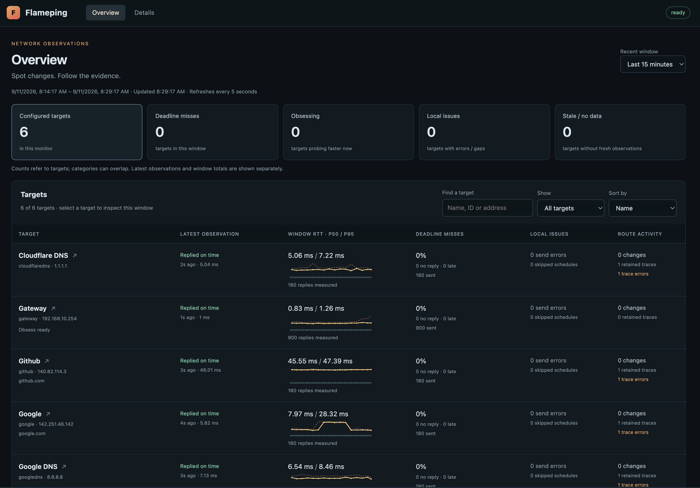
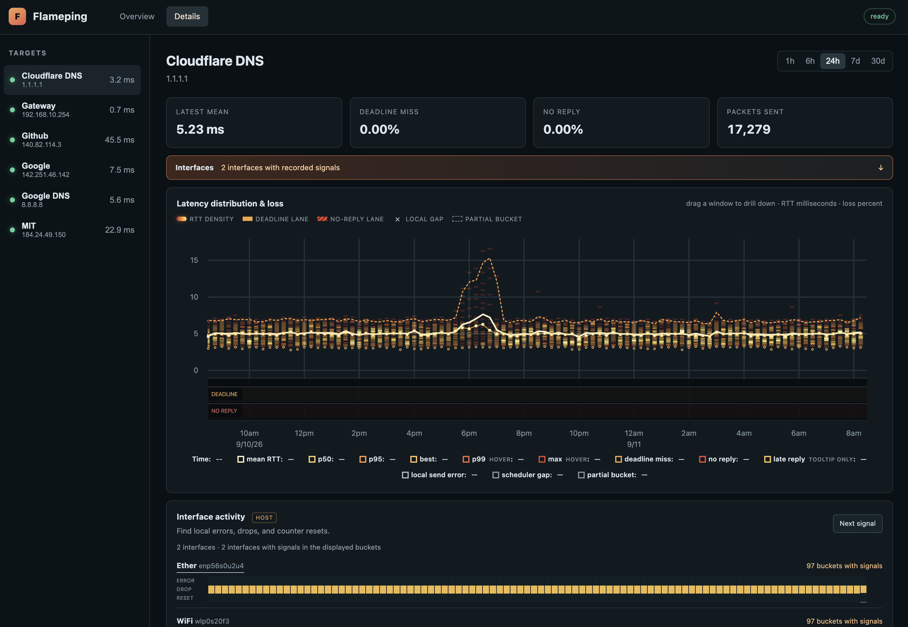

# Flameping

Flameping continuously pings your targets and graphs latency and packet loss
over time. Compare connections at a glance, then zoom into a slowdown to see
route changes and local interface activity alongside your ping history.

Inspired by SmokePing, it runs as a single Go executable with a built-in web
dashboard and a local SQLite database.

- **Compare targets at a glance.** See recent latency, missed deadlines, and
  measurement freshness together, then open the target you want to investigate.
- **Put changes in context.** Explore latency distributions, confirmed route
  changes, and host interface errors and drops on aligned timelines.
- **Capture more detail when trouble starts.** Opt-in *obsess mode* temporarily
  probes faster after loss or a latency spike, with intervals as short as 100 ms.
- **Keep history close at hand.** Revisit recent measurements and older summaries,
  with configurable retention and disk limits.

## Start with the overview

Compare all your targets over the last 5 minutes, 15 minutes, or hour. Search,
sort, or filter for deadline misses, active obsess probing, local collection
issues, and stale or missing observations. Each target's latest result appears
separately from its recent history, so one good ping doesn't hide a rough spell.



## Follow a target through time

Select a target to carry the same time window into its detailed charts. Zoom
into the latency and loss history, inspect changed traceroute hops, and compare
local interface counter activity in that period. Select a route or interface
interval to reveal its recorded details; chart presets return to a live view.



## Quick start

Build with **Go 1.25 or newer** and `make`. The web assets are included in the
repository, so Node is not needed for a normal build.

```sh
git clone https://github.com/opshed/flameping.git
cd flameping
make build
cp configs/flameping.example.yaml flameping.yaml
./flameping check-config --config flameping.yaml
./flameping doctor --config flameping.yaml
./flameping run --config flameping.yaml
```

Open **<http://127.0.0.1:8080>**. The example probes `1.1.1.1`; replace or add
targets to monitor your own network.

On Linux, unprivileged echo probes require the running user's group to be allowed
by `net.ipv4.ping_group_range`. Receiving traceroute replies requires `CAP_NET_RAW`
or root. `doctor` reports the available capabilities; the
[deployment guide](docs/operations.md#deployment) covers the sample systemd unit.

You can also install the command with Go, then use `flameping` in place of
`./flameping` above:

```sh
CGO_ENABLED=0 go install github.com/opshed/flameping/cmd/flameping@latest
```

## Configure your targets

Start from the [complete example configuration](configs/flameping.example.yaml).
The snippets below are configuration fragments: replace the matching sections
in your file. Run `check-config` and restart Flameping after edits.

Use an IP address or hostname for each target. For example, replace `targets`
with your router and an external destination, adjusting the router address:

```yaml
targets:
  - id: router
    name: Home router
    address: 192.168.1.1
    traceroute: false
  - id: internet
    name: Internet
    address: 1.1.1.1
    traceroute: true
```

### Per-target ping settings

The top-level `ping` block supplies defaults. A target can override each timing
independently, so you can watch a nearby router more frequently than a remote
destination:

```yaml
ping:
  interval: 5s
  timeout: 1s
  min_interval: 100ms

targets:
  - id: router
    address: 192.168.1.1
    ping:
      interval: 1s
      timeout: 750ms
      min_interval: 250ms
  - id: internet
    address: 1.1.1.1  # Inherits the global timings.
```

Intervals have a hard floor of 100 ms. See the
[timing reference](docs/operations.md#per-target-ping-settings) for inheritance,
legacy fields, and shared engine limits.

### Probe faster with obsess mode

Enable `obsess` on a target to collect finer detail automatically. This example
normally pings every 5 seconds, switches to 100 ms after a missed deadline or an
on-time reply above 100 ms, and returns to normal after one continuous minute
of healthy probe evidence:

```yaml
targets:
  - id: internet
    address: 1.1.1.1
    ping:
      interval: 5s
      timeout: 1s
      min_interval: 100ms
    obsess:
      interval: 100ms
      latency_threshold: 100ms
      recover_after: 1m
```

For defaults, add `obsess: {}` instead: latency more than 50% above the recent
baseline triggers faster probing at the target's minimum interval. Missed
deadlines also trigger it. The fast interval must be shorter than normal; the
timeout stays unchanged. The dashboard shows the current state and recovery
progress. Read the [obsess mode details](docs/obsess-experiment.md) for baseline
and recovery rules.

### Add local interface activity

On Linux, replace `interfaces: []` with interfaces on the machine running
Flameping. Change `eth0` to an actual interface name:

```yaml
interfaces:
  - name: eth0
    display_name: WAN uplink
    interval: 5s
```

The dashboard shows errors, drops, counter resets, and RX/TX traffic alongside
the target charts. These counters describe the monitoring host and provide
context when investigating a target.

## Keep useful history

SQLite retains raw samples and rolls older measurements into one-minute and
one-hour summaries. Defaults keep 7 days of raw detail, 90 days of minute
detail, and 5 years of hourly history, subject to the configured disk budget.
The default database limit is 5 GiB; see
[storage tuning](docs/operations.md#tuning) for retention under pressure.

Flameping keeps measurement distinctions visible. A late reply still has a
measured latency, but counts as a missed deadline. No reply, local send errors,
and skipped schedules remain separate; local collection problems aren't counted
as network loss, and missing measurements stay explicit.

## Run and maintain it

```text
flameping run --config PATH
flameping check-config --config PATH
flameping doctor --config PATH
flameping version
flameping db backup --config PATH --output PATH
flameping db compact --config PATH
```

Backups are consistent while Flameping is running. Stop the daemon before
compacting. The [operations guide](docs/operations.md) covers systemd deployment,
health checks, backup, recovery, and tuning.

The web server listens on loopback by default and has no built-in authentication.
For remote access, use an authenticated reverse proxy. Binding to a public
listener also requires explicitly setting `server.allow_public`.

## Development

```sh
make test
make race
make web            # Requires Node/npm; regenerates embedded assets.
make browser-smoke  # Requires Node/npm and headless Chrome.
```

The HTTP API lives under `/api/v1`. `/healthz` reports process liveness;
`/readyz` reports storage-writer readiness.

- [Build metadata](docs/operations.md#build-metadata)
- [Overview behavior and measurement semantics](docs/overview-experiment.md)
- [Route activity details](docs/route-timeline-experiment.md)
- [Interface activity details](docs/interface-timeline-experiment.md)
- [Design rationale](docs/design-research.md) and
  [component invariants](docs/implementation-plan.md)

## License

Flameping's original source code, documentation, and assets are dedicated to the
public domain under [CC0 1.0 Universal](LICENSE), identified as `CC0-1.0` in SPDX.
See the [Creative Commons CC0 summary](https://creativecommons.org/publicdomain/zero/1.0/)
for a description of the dedication.

Dependencies retain their own licenses. [THIRD_PARTY_NOTICES.md](THIRD_PARTY_NOTICES.md)
contains the notices for the Go runtime, linked Go dependencies, and the uPlot
code bundled in the web UI. Include those notices when redistributing a built
executable or the bundled web assets.
